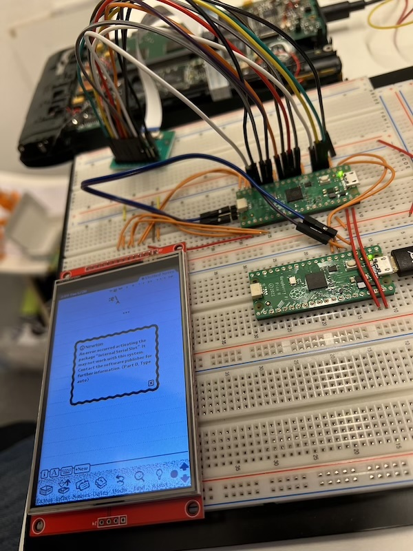

# newt_lcd
Convert Newton MP2x00 LCD data stream into TFT output

### [YouTube Video Explaining this Setup](https://youtu.be/Q1Ef7FQeF78?si=kHJoH5G_v21F1Ucw&t=712)

The Newton MessagePad MP2x00 is one of the first PDAs ever, produced by Apple in 1994, and infamous for its bad handwriting recognition. The project was abandoned by Apple, but a bunch of these machine and a core fan base remain.

One of the big issue with original MessagPad is the LCD. It never had great contrast to begin with, but over the years, the displays degraded more, or the eyes of the aging users degraded, probably both. 

I have been researching up and down the internet for replacement displays, but the original ones are not available new, and very few other displays have the same form factor. And even if they do, they are usualy color displays and have a completel different connector and protocol. Luckily, we live in 2024, and CPUs have become so fast, that they can easily scan the MP's output to the display, rearrange bytes, and generate output in a different format to go to a replacement display. 

The RP2040 for example can manage video in and out almost completely using its DMA and programmable PIO, and it still has two full blown ARM CPUs to manage the image data. It can extract grayscale information, upscale pixels and adapt to color displays, all while keeping the original hardware going. It can even convert touch information back into an analog signal for the ADC converter in the Newton.

So here is a description of my setup as shown in the picture above.

### LCD display connector to RP2040

To connect to the Newton MessagePad, we need a 20 pin 0.5mm pitch flat ribbon cable with pads on the same side (AWM 20624 80C 60V VW-1) and a matching breakout board into a 0.1" pin header (FPC-20P 0.5MM). It's always a good idea to measure the pins with a multimeter. The 20V pin must not be connected. Again, the Pico W pins are on the left, the display cable pins are on the right:

| Pin | Signal | Signal | Pin |
| --- | ------ | ------ | --- |
|  |  | n.c. | 1 |
|  |  | n.c. | 2 |
|  |  | n.c. | 3 |
| 4 | GP2 | VSYNC 75Hz | 4 | 
|  |  | n.c. | 5 |
| 5 | GP3 | HSYNC 24kHz | 6 |
|  |  | n.c. | 7 |
| 6 | GP4 | PCLK 1.5MHz | 8 |
| 9 | GP6 | D0 1.5Mhz | 9 |
| 10 | GP7 | D1 | 10 |
| 11 | GP8 | D2 | 11 |
| 12 | GP9 | D3 | 12 |
| 14 | GP10 | D4 | 13 |
| 15 | GP11 | D5 | 14 |
| 16 | GP12 | D6 | 15 |
| 17 | GP13 | D7 | 16 |
|  |  | n.c. | 17 |
|  |  | n.c. | 18 |
| 36 | GND | GND | 19 |
|  |  | n.c. | 20 |

### RP2040 to new TFT display

The second bunch of connectors go to the new TFT display. This part is quite flexible. We could connect an e-Paper display here. Waveshare has a nice 5.65" module that fits almost perfectly into the Newton case. On the left is the RP2040 Pico W, on the right are the pins of the Waveshare 4.0" 480x320 TFT:

| Pin | Signal | Signal | Pin |
| --- | ------ | ------ | --- |
| 18 | +3V | VCC | 1 |
| 36 | GND | GND | 2 |
| 22 | GP17 | CS | 3 |
| 19 | GP14 | RESET | 4 |
| 20 | GP15 | DC/RS | 5 |
| 25 | GP19 | SDI | 6 |
| 24 | GP18 | SCK | 7 |
| 18 | +3V | LED | 8 |
| 21 | GP16 | SDO | 9 |
|  | n.c. | TOUCH... | 10..14 |

### RP2040 debugging probe

We have two RP2040 Pico W, the second board is the Debug Probe for the first board. This needs 6 jumpers from RP1 to RP2 (debugger):

| Pin | Signal | Signal | Pin |
| --- | ------ | ------ | --- |
| 39 | VSYS | VSYS | 39 |
| 40 | GND | GND | 40 |
| X1 | SWCLK | GP2 | 4 |
| X3 | SWDIO | GP3 | 5 |
| 2 | RX0 | TX1 | 7 |
| 1 | TX0 | RX1 | 6 |

Note that the software at this point is just a proof on concept. Reading the data is done by bit-banging and could be greatly improved using DMA. We are writing to the TFT with 62.5MHz SPI, but this could also be optimized, and reading and writing could be assigned to different cores for full speed operation.

All in all, this was a really fun project. One big riddle remains: the LCD has just a B7W interface, and grayscale is generated by switching pixels on and off at th 75Hz frame rate. The pattern that is sent is unknown, and in the worst case, we would have to observe 16 frames before we can deterimine the true gray value of a pixel. This is important if we plan to send the gray values to an e-Paper display.

## to do:

A few tasks remain untile we know everything about the MP2x00 screen:
- find the pattern for every grayscale level: the display is just B&W. The 16 levels of gray are generated by pulsing the slow pixels on and off frame by frame. Knowing the pattern would allow us to convert screen content into true 4 bit gray values per pixel
- connect the touch screen back to the analog input of the screen
- use DMA to ensure that every frame is read and stored
- optimize the output to the new display to update only areas that changed (assuming a serial data interface), or use DMA to output a correct signal for passive displays
- connect and fully control an ePaper display that fits well into the existing case, same for OLED and TFT, and maybe a high contrast LCD
- if any of the above works well, design a felx cable and PCB that can be installed inside an existing MP2x00

